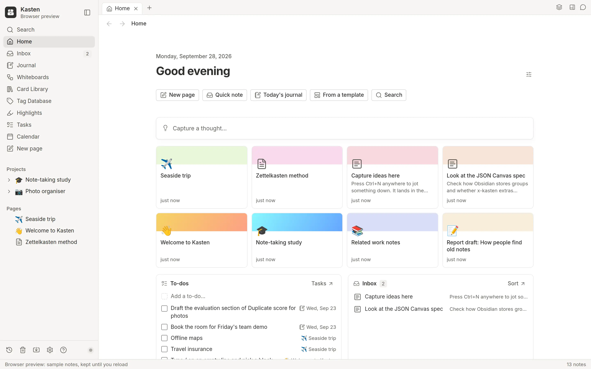

<p align="center">
  <picture>
    <source media="(prefers-color-scheme: dark)" srcset="docs/brand/lockup-dark.svg">
    
  </picture>
</p>

<p align="center">
  <b>Your daily journal and notes, as plain Markdown you own.</b>
</p>

<p align="center">
  <a href="docs/guide.md">User guide</a> ·
  <a href="CONTRIBUTING.md">Build from source</a> ·
  <a href="docs/community/SECURITY.md">Security</a>
</p>

<p align="center">
  <a href="LICENSE"></a>
  
</p>

<picture>
  <source media="(prefers-color-scheme: dark)" srcset="docs/screenshots/home-dark.webp">
  
</picture>

Kasten is a desktop app for your daily journal and notes. Write pages, plan
on whiteboards and keep every day in one place, as plain Markdown files in a
folder you choose. It includes Git history, optional AI tools and a slide
editor with PowerPoint export.

**Status: early software.** Start with sample notes and keep an independent
backup before using it for important work. Windows, macOS and Linux are
build targets; a source checkout alone does not establish that installers
have been tested on each platform.

Kasten is desktop-first. Backup must be configured, and it is not live sync.

## Get Kasten

Follow [CONTRIBUTING.md](CONTRIBUTING.md) for the pinned toolchain,
platform prerequisites and desktop build instructions.

For the browser preview, with Node and the repository's pnpm version installed:

```sh
pnpm install --frozen-lockfile
pnpm -C app dev
```

The preview uses browser storage and sample notes. It does not provide the
desktop app's filesystem, keychain or backup integration. Building the
Slides WebAssembly package also requires the pinned Rust toolchain and
`wasm-bindgen`; see the setup guide.

## What you can do

- **Write** pages like in Notion: `/` for any block, `[[` to link a page,
  covers, icons, tables, callouts, toggles and equations.
- **Plan** with project homes, a task board of every to-do, and a calendar
  of your notes by day.
- **Whiteboard**: cards, stickies, shapes, arrows and a
  pen, presented section by section.
- **Keep a journal**: today as a full page, the days before beside it.
- **Organise** with an inbox, a card library, and tags that become
  databases shown as a table, a board, a gallery or a calendar.
- **Back up** to GitHub, any git host, or a folder Dropbox, Google Drive or
  OneDrive keeps; restore on a new computer, and bring changes across with
  Get latest.

The [user guide](docs/guide.md) tours all of it.

## Your notes stay yours

- **Plain files.** Pages are Markdown, databases YAML, whiteboards JSON
  Canvas, all in one folder. [The format](docs/vault-format.md) is
  documented and versioned.
- **History and trash.** Kasten records changes in local Git history;
  typing is batched, and deleting normally moves content to trash. History
  on the same disk is not a substitute for a separate backup.
- **Guarded AI tools.** Kasten's MCP and chat tools apply review rules and
  protect notes locked for agents. Routine permitted changes may run
  without confirmation. These rules do not restrict an external agent
  that has separate filesystem or shell access.

Use vaults from trusted sources. See the [security policy](docs/community/SECURITY.md)
for the trust model, reporting, and the
[known Linux dependency issue](docs/community/SECURITY.md#known-linux-dependency-issue).

## Documentation

- [User guide](docs/guide.md): a tour, templates and kits, AI, quick
  capture, agents, backup and restore, and updates
- [Vault format](docs/vault-format.md): every file Kasten writes
- [Slides deck format](docs/slides-format.md): what is in a `.deck` file
- [Contributing](CONTRIBUTING.md): building, testing and the project's rules
- [Changelog](CHANGELOG.md): what each release brings

## License

[MIT](LICENSE). The Slides engine and editor (`crates/slides-*` and `packages/*`) are Apache-2.0; each folder carries its own `LICENSE`.
