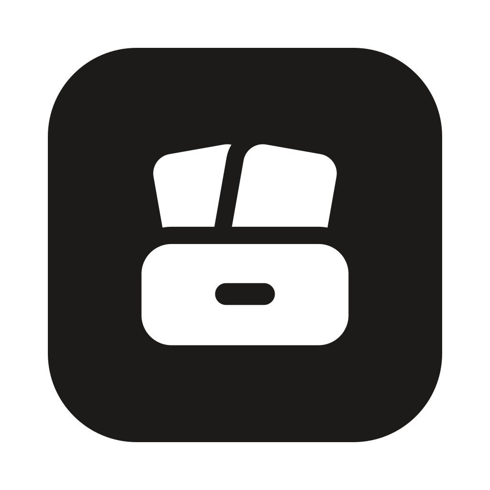

# Kasten brand



The mark is a **card box**:

- two index cards, fanned evenly;
- standing in a box with a label slot.

A *Kasten* is a box, as in *Zettelkasten*, the box of index cards the app is named after. The mark shows what the app keeps: notes as cards, in one box that is yours. It is one flat shape in one colour, and it reads at 16 px.

## Files

| File | What it is | Use it for |
|---|---|---|
| [`logo.svg`](logo.svg) | White mark on an ink tile, on Apple's icon grid (824 px in 1024) | The app icon source (`app/app-icon.svg`) |
| [`logo-tile.svg`](logo-tile.svg) | The tile, edge to edge | Favicons (`app/public/favicon.svg`) |
| [`mark.svg`](mark.svg) | The card box alone, in `currentColor` | Anywhere text could go |
| [`lockup.svg`](lockup.svg), [`lockup-dark.svg`](lockup-dark.svg) | The tile beside the name, for light and for dark pages; on dark pages the tile turns to paper | The README and the website |
| [`social-preview.png`](social-preview.png) | A 1280×640 card for links to the repository | GitHub → Settings → Social preview |

`scripts/brand.mjs` writes every SVG above, and the app's copies, from one set of numbers on a 24 grid:

| Part | Shape |
|---|---|
| Box | 18 × 8.8 at (3, 12.2), corner radius 2.6 |
| Label slot | 5.2 × 1.9 at (9.4, 15.6), cut out of the box |
| Cards | 8.2 × 11, corner radius 1.7, turned −10° and +10° about their bottom centres |
| Gaps | 1.5 wide, where each shape meets what is behind it |

On the tile, the mark is drawn at 70 %, a touch high, because the box makes the bottom heavy.

Change the numbers there, then run:

```sh
node scripts/brand.mjs
pnpm -C app tauri icon app-icon.svg -o /tmp/icons
```

From `/tmp/icons`, copy back into `app/src-tauri/icons/` only the files `tauri.conf.json` lists, plus `64x64.png` and `icon.png`.

In the app, `BrandMark` (`app/src/ui/BrandMark.tsx`) draws the same shapes in the theme's colours:

- the sidebar and the first-run screen show it on a tile;
- `working` makes the cards rise out of the box and settle, while Kasten works: a chat thinking, a brainstorm under way. Under reduced motion they rest.

## Colour

| Name | Value | Where |
|---|---|---|
| Ink | `#1C1B1A` | The tile, and the mark on light ground |
| Paper | `#FFFFFF` | The mark on the tile |

In the app, the mark follows the theme (`--color-ink` and `--color-canvas`). The logo takes no colour of its own; the interface keeps its one accent for actions.

## Type

The wordmark is the word *Kasten* in the system UI font, weight 700, tracked in by 2–3 %. The app ships no web fonts. The social preview was rendered once with Inter (SIL Open Font License), which is not part of the app.

## Do and don't

- Keep clear space around the mark of at least a card's width.
- Keep the gaps between the cards and the box: they are what make the cards read as cards.
- Don't add gradients, shadows or outlines. Don't rotate the mark or recolour a card on its own.
- At 16 px, use the tile (`logo-tile.svg`).
