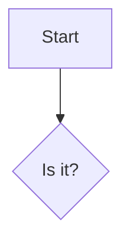

```rust
fn main() {
    println!("hi");
}
```

~~~python
print("tilde fence")
~~~

````markdown
```nested fence inside```
````

```js title="example.js" {2}
const a = 1;
const b = 2;
```

```
no language
```

    indented code block
    second line



```text
[[Not a link]] and $not math$ and *not em*
```

```
trailing spaces inside code   
	a tab-indented line
```
